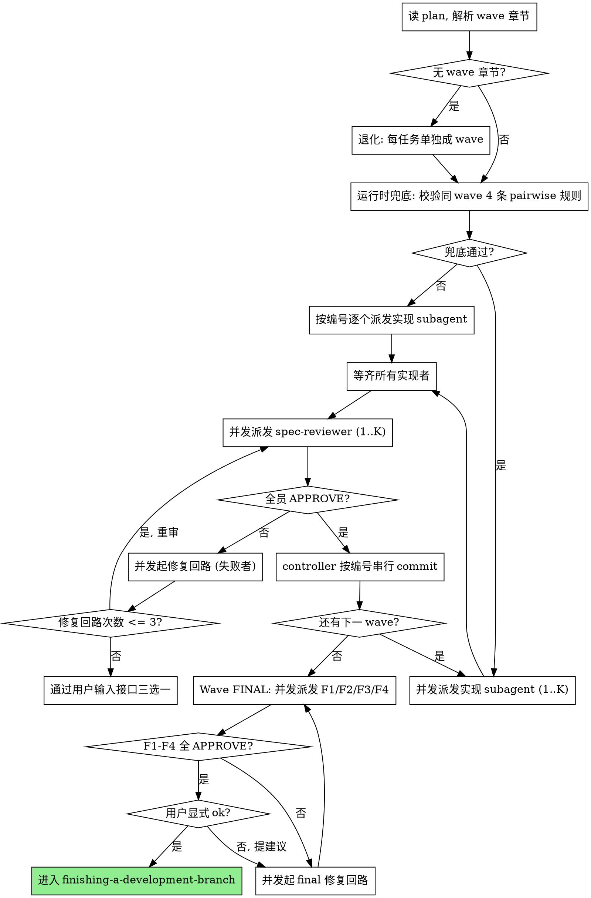

# Wave 化并行工作流改造 实现计划

> **面向 AI 代理的工作者：** 必需子技能：使用 superpowers:subagent-driven-development（推荐）或 superpowers:executing-plans 逐任务实现此计划。步骤使用复选框（`- [ ]`）语法来跟踪进度。

**目标：** 把 superpowers-zh 的 plan→execute 工作流从纯串行升级为 wave 化并行，原生消除手动调用 dispatching-parallel-agents 的需要，同时保持单 agent（无 subagent 支持）平台的完全向后兼容。

**架构：** 三层改造。
1. **plan 格式层** — `writing-plans` 产出"加性覆盖式" plan：任务列表保持线性拓扑序（`executing-plans` 直接走），每个任务头部新增 5 行 metadata（依赖/文件集/导出接口/消费接口/复杂度），文末新增 `## 并行执行图` 章节（仅 `subagent-driven-development` 解析使用）。
2. **执行调度层** — `subagent-driven-development` 内联 wave 调度：wave 内并发派发 implementer + spec-reviewer，wave 间阻塞 gate；commit 由 controller 在 wave 收口串行执行；修复回路并发，3 次失败逃生口，修复 subagent 不重读文件。
3. **plan 级审查层** — 所有 wave 完成后启动 Wave FINAL：4 个 reviewer（F1 规格合规 / F2 代码质量 / F3 真实手测 / F4 范围保真）并发派发，全员 APPROVE 后等用户显式 ok 才进收尾。

**技术栈：** 纯 Markdown skill 文件改造（SKILL.md + prompt 模板），无代码、无依赖、无运行时。

**测试策略：** 文档改动无 TDD。每任务用"精确编辑 → commit"两步。最终自举验证由 Wave FINAL F3 完成。

---

## 文件结构

**修改：**
- `skills/executing-plans/SKILL.md` — 加忽略 `## 并行执行图` 章节的说明
- `skills/dispatching-parallel-agents/SKILL.md` — description 收窄 + 顶部加 callout
- `skills/writing-plans/SKILL.md` — 新增 metadata 字段要求、自检规则第 4 项、并行执行图渲染规则
- `skills/writing-plans/plan-document-reviewer-prompt.md` — 加 metadata 完整性 / 严格语法 / wave 切分 / R2+ 4 条 pairwise 规则检查项
- `skills/subagent-driven-development/SKILL.md` — 重写流程：wave 调度 + 修复回路 + final wave 四审 + 用户闸门
- `skills/subagent-driven-development/implementer-prompt.md` — 去 commit 步骤 + 文件集约束 + 修复模式分支
- `skills/subagent-driven-development/spec-reviewer-prompt.md` — 明确 task-local 范围

**新建：**
- `skills/subagent-driven-development/wave-final-spec-prompt.md` — F1 全 plan 规格合规审查
- `skills/subagent-driven-development/wave-final-quality-prompt.md` — F2 跨任务代码质量审查（吸收原 code-quality-reviewer 内核，同任务删除原文件）
- `skills/subagent-driven-development/wave-final-manual-qa-prompt.md` — F3 真实手动 QA
- `skills/subagent-driven-development/wave-final-scope-fidelity-prompt.md` — F4 范围保真检查

---

## 任务

### 任务 1：executing-plans 加忽略 wave 章节说明

**依赖：** 无
**文件集：** `skills/executing-plans/SKILL.md`
**导出/变更接口：** 无
**消费接口：** 无
**复杂度：** quick

- [ ] **步骤 1：应用 Edit**

`skills/executing-plans/SKILL.md`：
- old_string：`### 步骤 1：加载并审查计划\n\n1. 读取计划文件`
- new_string：`### 步骤 1：加载并审查计划\n\n> **注意：** plan 包含两层 \`subagent-driven-development\` 专用元数据，**本 skill 全部忽略**：\n>\n> 1. **任务头部 5 行 metadata**（\`**依赖：**\` / \`**文件集：**\` / \`**导出/变更接口：**\` / \`**消费接口：**\` / \`**复杂度：**\`）：仅供阅读、帮助你理解为什么任务这样排序，**不影响执行**——按任务编号串行执行即可，不要尝试根据它们重排或并发。\n> 2. **\`## 并行执行图\` 章节**：wave 划分图，仅 subagent-driven-development 解析使用，executing-plans 直接跳过。\n>\n> plan 已保证拓扑序（任务 N 的依赖 ⊆ {任务 1..N-1}），按编号串行执行就是安全的。\n\n1. 读取计划文件`

- [ ] **步骤 2：Commit**

```bash
git add skills/executing-plans/SKILL.md
git commit -m "docs(executing-plans): 让 executing-plans 显式忽略 plan 中的并行执行图章节"
```

---

### 任务 2：dispatching-parallel-agents description 收窄 + 顶部 callout

**依赖：** 无
**文件集：** `skills/dispatching-parallel-agents/SKILL.md`
**导出/变更接口：** `dispatching-parallel-agents::skill-description`
**消费接口：** 无
**复杂度：** quick

- [ ] **步骤 1：应用 Edit (a) — 修改 frontmatter description**

`skills/dispatching-parallel-agents/SKILL.md`：
- old_string：`description: 当面对 2 个以上可以独立进行、无共享状态或顺序依赖的任务时使用`
- new_string：`description: 非 plan 场景下，2+ 个独立任务需要并行派发时使用（典型：多个独立 bug 排查、多文件并行验证、多分支批量重试）。Plan 驱动场景请使用 subagent-driven-development。`

- [ ] **步骤 2：应用 Edit (b) — 加顶部 callout**

`skills/dispatching-parallel-agents/SKILL.md`：
- old_string：`# 并行分派智能体\n\n## 概述`
- new_string：
```
# 并行分派智能体

> **如果你正在执行一个 plan（来自 writing-plans），不要用本 skill。**
> `subagent-driven-development` 已经原生包含 wave 化并行调度（wave 内并发实现 + wave 间阻塞 gate + Wave FINAL 四审）。
> 本 skill 用于 plan 之外的临时并行派发场景（多 bug 排查、多文件验证、多分支批量重试等）。

## 概述
```

- [ ] **步骤 3：Commit**

```bash
git add skills/dispatching-parallel-agents/SKILL.md
git commit -m "docs(dispatching-parallel-agents): description 收窄到非 plan 场景，顶部加路由 callout"
```

---

### 任务 3：writing-plans SKILL.md 升级元数据规则 + 自检规则 + wave 渲染规则

**依赖：** 无
**文件集：** `skills/writing-plans/SKILL.md`
**导出/变更接口：** `plan-format::metadata-fields`, `plan-format::wave-graph`, `writing-plans::self-check-rules`
**消费接口：** 无
**复杂度：** standard

- [ ] **步骤 1：应用 Edit (a) — 在"任务结构"段添加 metadata 必填要求**

`skills/writing-plans/SKILL.md`：
- old_string：
```
## 任务结构

````markdown
### 任务 N：[组件名称]

**文件：**
- 创建：`exact/path/to/file.py`
- 修改：`exact/path/to/existing.py:123-145`
- 测试：`tests/exact/path/to/test.py`
```

- new_string：
```
## 任务结构

每个任务头部**必须**包含 5 行 metadata（5 行均必填，无相关项写 `无`）：

| 字段 | 含义 | 示例 |
|---|---|---|
| `**依赖：**` | 本任务依赖的其他任务编号 | `任务 2, 任务 3` 或 `无` |
| `**文件集：**` | 本任务会创建/修改的所有文件路径 | `src/users.ts, tests/users.test.ts` |
| `**导出/变更接口：**` | 本任务对外暴露/变更的符号（函数、类型、常量） | `users.ts::createUser, users.ts::UserDTO` 或 `无` |
| `**消费接口：**` | 本任务依赖的、可能由其他任务变更的符号 | `db.ts::query, validator.ts::validate` 或 `无` |
| `**复杂度：**` | `quick` / `standard` / `deep`（三选一精确匹配） | `standard` |

**严格语法（machine-parseable，不允许变体）：**

- **分隔符：** 列表项之间唯一合法分隔符是 **`, `（英文逗号 + 单个空格）**。禁止使用中文逗号 `，`、顿号 `、`、`和`、`与` 等其它形式
- **空列表：** 当无相关项时写字面量 **`无`**。禁止留空、写 `-`、写 `[]`、写 `N/A`
- **任务编号：** 严格形式 `任务 N`，即"任务"+一个空格+阿拉伯数字。禁止 `Task 2`、`任务2`、`#2`、中文数字
- **文件路径：** 相对项目根的 **POSIX 风格路径**（用 `/`，禁用 `\`）
- **接口符号：** 严格形式 `<相对路径>::<符号名>`，双冒号 `::` 紧贴两侧无空格。`符号名` 是函数/类型/常量名
- **Markdown 反引号包裹（可选美化）：** 路径与符号值**允许**用反引号 `` ` `` 包裹用于 Markdown 渲染美化，例如 `` `src/users.ts` `` 或 `` `users.ts::createUser` ``。**parser 必须先剥离反引号再做语义解析**。本规范的"分隔符 / 空列表 / 任务编号 / 路径 / 符号"语义是剥离反引号后的内容
- **复杂度：** 严格三选一字符串：`quick`（单文件机械改动）、`standard`（多文件协调）、`deep`（架构判断）。可选用反引号包裹，禁止其它值

**为什么必填且需严格语法：** 这 5 行是 `subagent-driven-development` 构建并发安全 wave 调度图的**唯一信源**，需要 LLM 机械化 parse。任何变体形式都可能让契约扫描漏判冲突。`executing-plans` 不消费它们但也不受影响（线性执行依然正确）。

````markdown
### 任务 N：[组件名称]

**依赖：** 任务 2, 任务 3
**文件集：** `src/users.ts`, `tests/users.test.ts`
**导出/变更接口：** `users.ts::createUser`, `users.ts::UserDTO`
**消费接口：** `db.ts::query`, `validator.ts::validate`
**复杂度：** standard

**文件：**
- 创建：`exact/path/to/file.py`
- 修改：`exact/path/to/existing.py:123-145`
- 测试：`tests/exact/path/to/test.py`
```

- [ ] **步骤 2：应用 Edit (b) — 在"自检"段添加 4-6 项**

`skills/writing-plans/SKILL.md`：
- old_string：`**3. 类型一致性：** 后续任务中使用的类型、方法签名和属性名是否与前面任务中定义的一致？任务 3 中叫 \`clearLayers()\` 但任务 7 中叫 \`clearFullLayers()\` 就是 bug。\n\n如果发现问题，直接内联修复。`

- new_string：
```
**3. 类型一致性：** 后续任务中使用的类型、方法签名和属性名是否与前面任务中定义的一致？任务 3 中叫 `clearLayers()` 但任务 7 中叫 `clearFullLayers()` 就是 bug。

**4. 接口契约扫描（机械执行）：** 逐对扫描所有任务 (A, B)。

**4.1 推导隐式依赖：**
- 若 `B.消费接口 ∩ A.导出/变更接口 ≠ ∅`，则 A → B 必须是显式依赖（B 的 `**依赖：**` 必须包含 A）。缺则**自动补上**并重排 wave。
- 反向同理：若 `A.消费接口 ∩ B.导出/变更接口 ≠ ∅`，则 B → A 必须显式依赖。

**4.2 同 Wave 安全前提（最终精确版本，必须 4 条全部满足）：** 同一 wave 内任意两任务 (A, B) 必须满足：

| # | 规则 | 含义 |
|---|---|---|
| 1 | `A.文件集 ∩ B.文件集 = ∅` | 不可同改一个文件 |
| 2 | `A.导出 ∩ B.导出 = ∅` | 不可同时变更同一对外符号 |
| 3 | `A.导出 ∩ B.消费 = ∅` | A 改的 B 不能消费——若需消费应建立显式依赖（被规则 4.1 自动补上后会被分到不同 wave） |
| 4 | `B.导出 ∩ A.消费 = ∅` | 同 #3 反向 |

**关键：`A.消费 ∩ B.消费 ≠ ∅` 完全允许** —— 两任务同读一个上游接口（例如多个 wave-final reviewer 同时消费 `wave-final-protocol`）不构成冲突。**绝不**把"符号空间互不相交"当作单一规则——必须按上面 4 条精确判断。

**4.3 文件集越界声明：** 每任务 `**文件集：**` 是 implementer 的硬约束，越界改动在 wave 收口 commit 前被 `git diff --name-only` 检出 → plan 失败，通过用户输入接口让用户在"重派修复 / 换模型 / 放弃 plan"中三选一（详见 subagent-driven-development SKILL.md "Commit 时机与文件集越界校验"段）。

**5. 拓扑序检查：** 任务编号顺序是否合法拓扑序？任务 N 的 `**依赖：**` 是否全部 ⊆ {任务 1..N-1}？若否，重排任务编号。

**6. 并行执行图渲染（必填章节）：** plan 文末必须有 `## 并行执行图` 章节，内容机械生成（见下文）。

如果发现问题，直接内联修复。
```

- [ ] **步骤 3：应用 Edit (c) — 新增"并行执行图渲染"段**

`skills/writing-plans/SKILL.md`：
- old_string：`如果发现问题，直接内联修复。无需重新审查——修好继续推进。如果发现规格中的需求没有对应任务，就添加任务。\n\n## 执行交接`
- new_string：
```
如果发现问题，直接内联修复。无需重新审查——修好继续推进。如果发现规格中的需求没有对应任务，就添加任务。

## 并行执行图渲染（必填章节）

plan 文末必须有以下结构的章节，由你（writing-plans skill）根据每个任务的 `**依赖：**` 字段机械计算：

```markdown
## 并行执行图

> 仅 `subagent-driven-development` 使用；`executing-plans` 忽略本节。

**Critical Path:** 任务 1 → 任务 5 → 任务 8 → 任务 12

- Wave 1（无依赖）：任务 1, 任务 2, 任务 3
- Wave 2（依赖 Wave 1）：任务 4（依赖 1, 2）, 任务 5（依赖 3）
- Wave 3（依赖 Wave 2）：任务 8（依赖 5）, 任务 9（依赖 4）
- Wave FINAL（所有任务完成后）：F1 规格合规、F2 代码质量、F3 真实手测、F4 范围保真
```

**Wave 划分算法：**
1. Wave 1 = 所有 `**依赖：**` 为 `无` 的任务
2. Wave N = 所有任务，使其 `**依赖：**` 全部 ⊆ Wave 1 ∪ ... ∪ Wave N-1，且不属于已分配的 wave
3. Wave FINAL 永远是固定的 F1-F4 四个 reviewer 任务（不写在主任务列表中）

**Critical Path：** 从 Wave 1 到最终 Wave 的最长路径（按依赖链）。给读者一个"瓶颈在哪"的直观信号。

**目标 wave 大小：** 5-8 任务/wave；少于 3 任务/wave（除 Wave FINAL）通常意味着拆分过细或依赖标注过严。

## 执行交接
```

- [ ] **步骤 4：Commit**

```bash
git add skills/writing-plans/SKILL.md
git commit -m "feat(writing-plans): 新增任务级 metadata 5 字段 + 接口契约扫描自检 + 并行执行图渲染规则"
```

---

### 任务 4：plan-document-reviewer-prompt 升级

**依赖：** 任务 3
**文件集：** `skills/writing-plans/plan-document-reviewer-prompt.md`
**导出/变更接口：** `plan-document-reviewer::checks`
**消费接口：** `plan-format::metadata-fields`, `plan-format::wave-graph`
**复杂度：** quick

- [ ] **步骤 1：应用 Edit — 扩展检查表**

`skills/writing-plans/plan-document-reviewer-prompt.md`：
- old_string：
```
    | 类别 | 检查要点 |
    |------|----------|
    | 完整性 | TODO、占位符、不完整的任务、缺失的步骤 |
    | 规格对齐 | 计划覆盖了规格需求，没有重大范围蔓延 |
    | 任务分解 | 任务有清晰的边界，步骤可执行 |
    | 可构建性 | 工程师能否按此计划执行而不会卡住？ |
```

- new_string：
```
    | 类别 | 检查要点 |
    |------|----------|
    | 完整性 | TODO、占位符、不完整的任务、缺失的步骤 |
    | 规格对齐 | 计划覆盖了规格需求，没有重大范围蔓延 |
    | 任务分解 | 任务有清晰的边界，步骤可执行 |
    | 可构建性 | 工程师能否按此计划执行而不会卡住？ |
    | Metadata 完整性 | 每任务是否填齐 5 行 metadata：`**依赖：**` / `**文件集：**` / `**导出/变更接口：**` / `**消费接口：**` / `**复杂度：**`？无相关项是否写 `无` 而非留空？ |
    | Metadata 严格语法 | 每任务的 metadata 是否符合 `writing-plans/SKILL.md` 中"严格语法（machine-parseable）"段：分隔符是英文逗号+空格、空列表写 `无`、任务编号格式 `任务 N`（中间有空格）、路径 POSIX 风格（禁 `\`）、接口符号严格 `path::sym` 双冒号紧贴、复杂度精确三选一 `quick`/`standard`/`deep`（**复杂度值同样可选反引号包裹，parser 剥离**）？反引号包裹路径/符号/复杂度被允许（parser 剥离），但其它变体（中文逗号、顿号、`Task 2`、`任务2`、Windows 路径分隔符、复杂度写 `medium`/`高`/`低` 等）一律视为缺陷。 |
    | 拓扑序 | 任务编号顺序是否合法拓扑序？任务 N 的 `**依赖：**` 是否全部 ⊆ {任务 1..N-1}？ |
    | 接口契约一致性 | 逐对扫描任务 (A, B)：若 `B.消费接口 ∩ A.导出/变更接口 ≠ ∅`，B 的 `**依赖：**` 是否包含 A？ |
    | Wave 并行安全（4 条 pairwise 规则） | 同一 wave 内任意两任务 (A, B) 是否满足 4 条规则：(1) `A.文件集 ∩ B.文件集 = ∅`；(2) `A.导出/变更接口 ∩ B.导出/变更接口 = ∅`；(3) `A.导出/变更接口 ∩ B.消费接口 = ∅`；(4) `B.导出/变更接口 ∩ A.消费接口 = ∅`。`A.消费 ∩ B.消费 ≠ ∅` 完全允许。 |
    | 并行执行图 | plan 文末是否有 `## 并行执行图` 章节？wave 划分是否与 `**依赖：**` 标注一致？是否有 Critical Path？ |
```

- [ ] **步骤 2：Commit**

```bash
git add skills/writing-plans/plan-document-reviewer-prompt.md
git commit -m "feat(plan-reviewer): 加入 metadata/拓扑序/接口契约/文件集/wave 图 5 项机械化检查"
```

---

### 任务 5：subagent-driven SKILL.md 重写流程

**依赖：** 任务 3
**文件集：** `skills/subagent-driven-development/SKILL.md`
**导出/变更接口：** `wave-scheduling-protocol`, `wave-final-protocol`, `fix-loop-protocol`
**消费接口：** `plan-format::metadata-fields`, `plan-format::wave-graph`
**复杂度：** deep

- [ ] **步骤 1：应用 Edit (a) — 替换"何时使用"段的对比文本**

`skills/subagent-driven-development/SKILL.md`：
- old_string：`**与 Executing Plans（并行会话）的对比：**\n- 同一会话（无上下文切换）\n- 每个任务全新子智能体（无上下文污染）\n- 每个任务后两阶段审查：先规格合规性，再代码质量\n- 更快的迭代（任务间无需人工介入）`
- new_string：
```
**与 Executing Plans（并行会话）的对比：**
- 同一会话（无上下文切换）
- 每个任务全新子智能体（无上下文污染）
- **wave 内并发派发实现者（前提：plan 含 `## 并行执行图` 章节，且同 wave 任务满足 R2+ 4 条 pairwise 规则——文件集 / 导出∩导出 / 导出∩消费 / 消费∩导出 全部为 ∅；`A.消费 ∩ B.消费` 允许）**
- 每个任务后规格合规审查（task-local，可并发）
- 全 plan 完成后启动 **Wave FINAL**：4 个 reviewer 并发（F1 规格合规 / F2 代码质量 / F3 真实手测 / F4 范围保真）
- 更快的迭代（任务间无需人工介入；wave 收口需用户显式 ok 才进收尾）
```

- [ ] **步骤 2：应用 Edit (b) — 替换主流程 dot 图**

`skills/subagent-driven-development/SKILL.md`：
- old_string：从 `## 流程\n\n\`\`\`dot` 到该 dot 图代码块结束（即下一个 \`\`\` 行）的全部内容
- new_string（新流程图）：
```
## 流程


```

- [ ] **步骤 3：应用 Edit (c) — 新增"运行时兜底校验"段**

`skills/subagent-driven-development/SKILL.md`：
- old_string（紧跟流程图代码块之后）：`\`\`\`\n\n## 模型选择`
- new_string：
```
\`\`\`

## 运行时兜底校验

读完 plan 之后、派发 wave N 的 implementer 之前，必须执行以下校验：

1. **解析 wave 章节**：从 `## 并行执行图` 章节读出 wave N 的任务列表 `[T_a, T_b, T_c, ...]`。
2. **pairwise 安全前提检查**（4 条规则全部满足才允许并发）：对 wave N 内任意两任务 (A, B) 验证：
   - `A.文件集 ∩ B.文件集 = ∅`
   - `A.导出/变更接口 ∩ B.导出/变更接口 = ∅`
   - `A.导出/变更接口 ∩ B.消费接口 = ∅`
   - `B.导出/变更接口 ∩ A.消费接口 = ∅`
   - **不查 `A.消费 ∩ B.消费`**——同读上游接口不冲突（例如 wave-final 的 4 个 reviewer 同时消费 `wave-final-protocol` 是合法的）
3. **判定**：
   - 4 条全过 → 同消息内并发派发全部 K 个 implementer
   - 任一条破坏 → 降级为 wave 内按编号串行（仍是逐个派发，下一 wave 仍按 wave gate 规则等待）

兜底校验执行两个时刻：
- **plan 加载时全量校验**：派发 wave 1 之前，对全部 N 个 wave 的 4 条 pairwise 规则一次性校验完毕。
- **修复回路并发派发前**：仅校验当前 wave（修复回路本身是新增的并发动作，需要确认修复 subagent 之间也满足并发安全前提）。

正常 wave 派发不重跑——plan-document-reviewer 已做过同样检查，运行中不变量保持。

**并发安全说明：** 4 条规则保证了 wave 内任务的工作区不冲突——多个 implementer 或修复者同时编辑不同文件不存在 race，**无需 worktree 隔离或显式锁机制**。

## 模型选择
```

- [ ] **步骤 4：应用 Edit (d) — 在"处理实现者状态"段后追加修复回路 + Commit 闸门**

`skills/subagent-driven-development/SKILL.md`：
- old_string：`**绝不** 忽略上报或在不做任何更改的情况下让同一模型重试。如果实现者说卡住了，说明有什么东西需要改变。`
- new_string：
```
**绝不** 忽略上报或在不做任何更改的情况下让同一模型重试。如果实现者说卡住了，说明有什么东西需要改变。

## 修复回路与 3 次逃生口

当 spec-reviewer 给出 ❌ 结果时，启动修复回路：

1. **打包上下文给修复 subagent**（修复者**不重读文件**）：
   - 原任务的完整文本（与初次派发同样）
   - **上一次实现者的产出报告**（包括它声称改了哪些文件、自审发现）
   - **上一次实现的实际 diff**（controller 用 `git diff` 提取 working tree 改动）
   - **当前 reviewer 的具体反馈**（缺什么、多什么、错在哪）
2. 派发 implementer-prompt 的"修复模式"（见 `./implementer-prompt.md`），它仍不 commit。
3. 修完后再派发 spec-reviewer 重审。

修复回路本身在 wave 内**并发**——多个任务同时不通过时，各自起独立修复回路同时跑。但下一 wave 必须等本 wave 全员通过 spec 审查 + commit 完成才开始（wave 间阻塞 gate）。

**并发安全说明：** 修复回路的并发安全由 R2+ 同 wave 安全前提（4 条 pairwise 规则）保证——同 wave 任务文件集 pairwise 互不相交，多个修复者同时编辑不同文件不存在 race。**无需 worktree 或显式锁。** 修复派发前 controller 重新执行兜底校验（修复回路是新增并发动作）。

### 3 次逃生口与 plan 失败处理

**设计原则：plan 是 AI 一次性烧掉的草稿，不是有状态的工程系统。** 中途任务死活搞不定时**不**维护 SKIP/BLOCKED 状态、**不**持久化 wave 进度、**不**做下游连锁追踪——直接判定 plan 失败，回头重新 brainstorm + writing-plans 写新 plan。

**3 次逃生口：** 同一任务的修复回路 ≤ 3 次。第 4 次仍未通过 → controller 通过用户输入接口向用户报告卡点，让用户**三选一**：

1. **提供更多上下文** → controller 重派修复（计数器重置，再 3 次窗口）
2. **用更强模型重派** → 同上，但换模型
3. **放弃 plan** → 整个 plan 标记为失败，建议回到 brainstorm + writing-plans 重新规划；当前会话退出 subagent-driven 流程

**没有"跳过任务继续跑"选项**——一旦失败就是 plan 失败。

**commit 闸门越界（详见下方）走同一处理路径：** 命中 → 通过用户输入接口 三选一。

## Commit 时机与文件集越界校验

implementer 与修复者**绝不**自行 commit。commit 在 wave 收口由 controller 串行执行，并设**双层文件集越界闸门**——wave 级硬约束 + 任务级软归因。

### 校验算法（关键设计）

**为什么不能"每任务跑 `git diff --name-only HEAD` 检查 ⊆ 该任务文件集"：** wave 内 N 个 implementer 并发完成后，工作区里堆叠 N 个任务的总改动。共享工作区下 controller 无法机械区分"哪些改动是哪个 implementer 写的"——只能信任 implementer 自报，配合事后审查。

### 两层闸门

**层 1：任务级 implementer 自报合规**

对每个任务 T（按编号顺序）：

1. 取 T 的 implementer 汇报清单 `claimed_files_T`
2. 校验：`claimed_files_T ⊆ T.**文件集：**`
3. **不通过 → plan 失败** → 通过用户输入接口 三选一
4. 通过 → controller 执行：
   ```bash
   git add <claimed_files_T 中的每个路径>
   git commit -m "<引用任务 T>"
   ```
5. 进入下一任务

**层 2：Wave 收口终态校验**

全部任务 commit 完成后，跑 `git diff --name-only HEAD`：

- 必须为空（工作区与 HEAD 完全一致，无未提交残留）
- **不空 → plan 失败** → 通过用户输入接口 三选一

通过层 2 后才进入下一 wave。

事后兜底由 Wave FINAL F4（范围保真）承担，捕捉 spec-reviewer 漏掉的"漏报文件被同 wave 别人 claim 走"场景。
```

- [ ] **步骤 5：应用 Edit (e) — 替换"提示词模板"段**

`skills/subagent-driven-development/SKILL.md`：
- old_string：
```
## 提示词模板

- `./implementer-prompt.md` - 分派实现子智能体
- `./spec-reviewer-prompt.md` - 分派规格合规审查子智能体
- `./code-quality-reviewer-prompt.md` - 分派代码质量审查子智能体
```

- new_string：
```
## 提示词模板

**任务级（每 wave 收口运行）：**
- `./implementer-prompt.md` — 派发实现子智能体（含初次实现 + 修复模式分支）
- `./spec-reviewer-prompt.md` — 派发 task-local 规格合规审查

**Plan 级（所有 wave 完成后并发派发）：**
- `./wave-final-spec-prompt.md` — F1 全 plan 规格合规审查
- `./wave-final-quality-prompt.md` — F2 跨任务代码质量审查
- `./wave-final-manual-qa-prompt.md` — F3 真实手动 QA
- `./wave-final-scope-fidelity-prompt.md` — F4 范围保真检查
```

- [ ] **步骤 6：应用 Edit (f) — 新增"Wave FINAL 协议"段**

`skills/subagent-driven-development/SKILL.md`：
- old_string：`## 示例工作流`（这个段落标题前插入新段）
- new_string：
```
## Wave FINAL 协议

所有实现 wave 完成后**必须**启动 Wave FINAL：

1. **并发派发 F1-F4 四个 reviewer**（同条消息内 4 个 Task() 调用）：
   - F1：规格合规审查（用 `./wave-final-spec-prompt.md`）
   - F2：代码质量审查（用 `./wave-final-quality-prompt.md`）
   - F3：真实手测（用 `./wave-final-manual-qa-prompt.md`）
   - F4：范围保真（用 `./wave-final-scope-fidelity-prompt.md`）
2. **每个 reviewer 给 `VERDICT: APPROVE` 或 `VERDICT: REJECT + 问题清单`**
3. **任一 REJECT** → 派发修复 subagent 修复对应问题 → 仅重跑该 reject 的 reviewer（不要重跑全部 4 个）
4. **全员 APPROVE** → 向用户呈现 4 个 reviewer 的输出摘要 → **等待用户显式 ok**（绝不自动收尾）
5. **用户 ok 后** → 进入 `superpowers:finishing-a-development-branch`

**关键不变量：**
- 4 个 reviewer 的关注点互不重叠（F1 规格 / F2 质量 / F3 行为 / F4 范围），各自独立判定
- 用户显式 ok 是最后人机协同闸门——绝不跳过
- 用户给反馈但未 ok（例如要求修改） → 视为 REJECT，起对应修复回路

## 示例工作流
```

- [ ] **步骤 7：应用 Edit (g) — 替换红线段**

`skills/subagent-driven-development/SKILL.md`：
- old_string：`- 并行分派多个实现子智能体（会冲突）`
- new_string：`- 在违反"同 wave 安全前提（4 条 pairwise 规则：文件集 / 导出∩导出 / 导出∩消费 / 消费∩导出 全部为空集）"下并行分派实现子智能体。运行时兜底校验失败时必须降级为 wave 内编号串行。`

- [ ] **步骤 8：应用 Edit (h) — 在"集成"段加反向引用**

`skills/subagent-driven-development/SKILL.md`：
- old_string：`**替代工作流：**\n- **superpowers:executing-plans** - 用于并行会话而非同会话执行`
- new_string：
```
**替代工作流：**
- **superpowers:executing-plans** - 用于并行会话而非同会话执行（不支持子代理的平台必备）

**通用并行派发模式（参考用）：**
- **superpowers:dispatching-parallel-agents** — 本 skill 在 plan 场景下的并行调度纪律是该 skill 通用模式的具体化。单个 subagent 的 prompt 写法、范围聚焦、约束设置等通用技巧仍参考其"模式"章节。
```

- [ ] **步骤 9：Commit**

```bash
git add skills/subagent-driven-development/SKILL.md
git commit -m "feat(subagent-driven): 重写主流程为 wave 化并行（兜底校验 + 修复回路 3 次逃生口 + Wave FINAL + 用户闸门）"
```

---

### 任务 6：spec-reviewer-prompt 微调 task-local 表述

**依赖：** 任务 3
**文件集：** `skills/subagent-driven-development/spec-reviewer-prompt.md`
**导出/变更接口：** 无
**消费接口：** `plan-format::metadata-fields`
**复杂度：** quick

- [ ] **步骤 1：应用 Edit — 加 task-local 范围声明 + 单文件级问题检查**

`skills/subagent-driven-development/spec-reviewer-prompt.md`：
- old_string：`你正在审查一个实现是否与其规格匹配。\n\n    ## 要求的内容`
- new_string：
```
你正在审查一个实现是否与其规格匹配。

    ## 你的范围（task-local）

    你**只**审查任务 N 的实现是否符合任务 N 的规格——
    具体范围 = 该任务的 `**文件集：**` 列出的文件中、本次 implementer 改动的部分。

    **不要**评论：
    - 跨任务的代码风格一致性（这是 Wave FINAL F2 的工作）
    - 全 plan 的规格覆盖度（这是 Wave FINAL F1 的工作）
    - 用户体验或真实功能正确性（这是 Wave FINAL F3 的工作）
    - 范围蔓延或 YAGNI 违反（这是 Wave FINAL F4 的工作）

    你**只**关心一件事：**这个任务的代码是否实现了这个任务的规格——不多不少。**

    ## 同时检查的单文件级问题（顺手做）

    在审查规格合规的同时，标记本任务改动文件中以下单文件级问题（这些不需要全局视角即可发现，task-local 视角顺手抓比让 Wave FINAL F2 重读所有文件高效）：

    - 过度注释（每行都有注释）
    - 通用命名（`data` / `result` / `item` / `temp` 满天飞）
    - 残留：`as any` / `@ts-ignore` / 空 catch / commented-out 代码 / `console.log` 在生产代码

    跨任务一致性问题（命名 / 抽象 / 重复）由 Wave FINAL F2 处理，你不审查。

    ## 要求的内容
```

- [ ] **步骤 2：Commit**

```bash
git add skills/subagent-driven-development/spec-reviewer-prompt.md
git commit -m "docs(spec-reviewer): 明确 task-local 范围，避免与 Wave FINAL 4 个 reviewer 职责重叠"
```

---

### 任务 7：implementer-prompt 改造（去 commit + 文件集约束 + 修复模式）

**依赖：** 任务 5
**文件集：** `skills/subagent-driven-development/implementer-prompt.md`
**导出/变更接口：** `implementer::contract`
**消费接口：** `wave-scheduling-protocol`
**复杂度：** standard

- [ ] **步骤 1：应用 Edit (a) — 替换"你的工作"段**

`skills/subagent-driven-development/implementer-prompt.md`：
- old_string：
```
    ## 你的工作

    当你确认需求清晰后：
    1. 严格按照任务指定的内容实现
    2. 编写测试（如果任务要求则遵循 TDD）
    3. 验证实现是否正常工作
    4. 提交你的工作
    5. 自审（见下文）
    6. 汇报
```

- new_string：
```
    ## 你的工作

    当你确认需求清晰后：
    1. 严格按照任务指定的内容实现
    2. 编写测试（如果任务要求则遵循 TDD）
    3. 验证实现是否正常工作（运行测试，确认通过）
    4. 自审（见下文）
    5. 汇报

    ## 文件集约束（关键）

    **你只能编辑任务的 `**文件集：**` 列出的文件。**
    其它任务的文件、其它 wave 的文件，绝不触碰——即使你认为它们也需要改。

    **绝不 `git add`、绝不 `git commit`。**
    commit 由协调者（controller）在本 wave 收口时按任务编号串行执行。
    你的产出 = 工作区中的代码改动 + 一份汇报。
```

- [ ] **步骤 2：应用 Edit (b) — 替换"汇报格式"段**

`skills/subagent-driven-development/implementer-prompt.md`：
- old_string：
```
    ## 汇报格式

    完成后汇报：
    - **状态：** DONE | DONE_WITH_CONCERNS | BLOCKED | NEEDS_CONTEXT
    - 你实现了什么（或尝试了什么，如果被阻塞）
    - 你测试了什么以及测试结果
    - 修改了哪些文件
    - 自审发现（如果有）
    - 任何问题或疑虑

    如果你完成了工作但对正确性有疑虑，使用 DONE_WITH_CONCERNS。
    如果你无法完成任务，使用 BLOCKED。如果你需要
    未提供的信息，使用 NEEDS_CONTEXT。绝不默默产出你不确定的工作。
```

- new_string：
```
    ## 汇报格式

    完成后汇报：
    - **状态：** DONE | DONE_WITH_CONCERNS | BLOCKED | NEEDS_CONTEXT
    - **改动文件清单**（每行一个绝对/项目相对路径，controller 会用它做 `git add`）：
      ```
      src/foo.ts
      tests/foo.test.ts
      ```
    - 你实现了什么（或尝试了什么，如果被阻塞）
    - 你测试了什么以及测试结果
    - 自审发现（如果有）
    - 任何问题或疑虑

    **改动文件清单必须与任务的 `**文件集：**` 完全一致或为其子集。**
    如果你不得不改文件集之外的文件，立即停下来以 `BLOCKED` 状态汇报，不要硬上。

    如果你完成了工作但对正确性有疑虑，使用 DONE_WITH_CONCERNS。
    如果你无法完成任务，使用 BLOCKED。如果你需要
    未提供的信息，使用 NEEDS_CONTEXT。绝不默默产出你不确定的工作。
```

- [ ] **步骤 3：应用 Edit (c) — 末尾追加"修复模式"分支**

`skills/subagent-driven-development/implementer-prompt.md`：
- old_string：`如果你完成了工作但对正确性有疑虑，使用 DONE_WITH_CONCERNS。\n    如果你无法完成任务，使用 BLOCKED。如果你需要\n    未提供的信息，使用 NEEDS_CONTEXT。绝不默默产出你不确定的工作。\n\`\`\``

- new_string：
```
如果你完成了工作但对正确性有疑虑，使用 DONE_WITH_CONCERNS。
    如果你无法完成任务，使用 BLOCKED。如果你需要
    未提供的信息，使用 NEEDS_CONTEXT。绝不默默产出你不确定的工作。

    ---

    ## 修复模式（仅在 controller 标记为修复回路时启用）

    如果本次派发是**修复回路**（controller 会在 prompt 中明确标注 `[修复模式]`），你将额外收到：
    - **上一次的实现报告**（包含改动文件清单、状态、自审）
    - **上一次的 working tree diff**（你不需要重读文件——这就是上次改了什么的精确记录）
    - **reviewer 的反馈**（缺什么、多什么、错在哪）

    修复模式纪律：
    1. **不要重读 plan 或重读文件来"重新理解任务"**——上次的 diff 和报告已经告诉你状态了
    2. 仅按 reviewer 反馈做最小修复——不要顺手重构
    3. 改动仍然限于任务 `**文件集：**`
    4. 修复完后仍**不 commit**，只汇报新的改动文件清单 + 修复了哪些 reviewer 反馈
    5. 你的状态仍然是 DONE / BLOCKED / NEEDS_CONTEXT 三选一
\`\`\`
```

- [ ] **步骤 4：Commit**

```bash
git add skills/subagent-driven-development/implementer-prompt.md
git commit -m "feat(implementer-prompt): 去 commit 步骤、加文件集约束、加修复模式分支（不重读文件）"
```

---

### 任务 8：wave-final-spec-prompt 新建（F1 全 plan 规格合规）

**依赖：** 任务 5
**文件集：** `skills/subagent-driven-development/wave-final-spec-prompt.md`
**导出/变更接口：** `wave-final::F1-spec-criteria`
**消费接口：** `wave-final-protocol`
**复杂度：** standard

- [ ] **步骤 1：创建文件**

新建 `skills/subagent-driven-development/wave-final-spec-prompt.md`，内容：

```markdown
# Wave FINAL · F1 规格合规审查 prompt 模板

派发 F1 reviewer 时使用此模板。F1 与 F2/F3/F4 并发派发，关注点**互不重叠**。

**F1 关注点（独占）：** 全 plan vs 原始规格的**条目级**对账。每条规格需求都要在实现里找到对应。

```
Task tool (general-purpose):
  description: "Wave FINAL F1: 全 plan 规格合规审查"
  prompt: |
    你是 Wave FINAL 的 F1 reviewer，做**全 plan 规格合规审查**。
    与你并发的还有 F2（代码质量）/ F3（真实手测）/ F4（范围保真）——它们各自审查不同维度，**不要越界**。

    ## 你的范围

    你审查整个 plan 的实现 vs 原始规格/需求文档的**逐条对账**：
    - **Must Have** 列表中每一条需求 → 是否在代码中实现？
    - **Must NOT Have / 边界条件** 列表中每一条 → 是否被遵守（无违反）？
    - 规格中的每个章节/小节 → 至少有一个对应的实现任务覆盖？

    ## 你不审查的内容（避免与其它 reviewer 重叠）

    - 代码风格、命名、抽象层级 → 这是 F2 的工作
    - 真实功能跑起来对不对 → 这是 F3 的工作
    - 是否实现了规格之外的东西 → 这是 F4 的工作

    ## 输入

    - **原始规格/plan：** [PLAN_FILE_PATH]
    - **本次实现的 commit 范围：** [BASE_SHA..HEAD_SHA]
    - **完整的 task 清单 + 实现汇报：** [由 controller 提供]

    ## 你的工作

    1. 通读 plan/规格，列出全部 **Must Have**、**Must NOT Have**、章节级需求
    2. 对每一条，在 commit 范围内找证据：
       - 实现的 file:line（哪段代码履行了这条需求）
       - 测试的 file:line（如有）
    3. 对找不到证据的需求，明确标记**缺失**

    ## 输出格式

    ```
    VERDICT: APPROVE | REJECT

    Must Have 覆盖：[N/M] 条
    Must NOT Have 遵守：[N/M] 条
    章节覆盖：[N/M] 节

    REJECT 原因（仅当 REJECT）：
    - [需求描述] — 缺失：在 commit 范围内未找到对应实现
    - [需求描述] — 违反：file:line 处出现禁止的模式
    ```
```

**当 F1 给 REJECT 时**：controller 派发修复 subagent 修缺失的需求，再仅重跑 F1（不要顺带重跑 F2/F3/F4）。
```

- [ ] **步骤 2：Commit**

```bash
git add skills/subagent-driven-development/wave-final-spec-prompt.md
git commit -m "feat(wave-final): 新增 F1 规格合规审查 prompt 模板"
```

---

### 任务 9：wave-final-quality-prompt 新建（F2 跨任务代码质量）+ 删除 code-quality-reviewer

**依赖：** 任务 5
**文件集：** `skills/subagent-driven-development/wave-final-quality-prompt.md`, `skills/subagent-driven-development/code-quality-reviewer-prompt.md`
**导出/变更接口：** `wave-final::F2-quality-criteria`
**消费接口：** `wave-final-protocol`, 原 `code-quality-reviewer-prompt.md` 内核
**复杂度：** standard

- [ ] **步骤 1：创建文件**

新建 `skills/subagent-driven-development/wave-final-quality-prompt.md`，内容（吸收原 code-quality-reviewer-prompt.md 的"文件级质量检查"4 项）：

```markdown
# Wave FINAL · F2 代码质量审查 prompt 模板

派发 F2 reviewer 时使用此模板。F2 与 F1/F3/F4 并发派发，关注点**互不重叠**。

**F2 关注点（独占）：** 跨任务的**全局**代码质量——只看一个任务的代码看不出"质量好不好"，必须横向比较才有判断。

```
Task tool (superpowers:code-reviewer):
  description: "Wave FINAL F2: 跨任务代码质量审查"

  使用模板 requesting-code-review/code-reviewer.md，附加以下 F2 专属指令：

  ## 你的范围

  你审查整个 plan 实现的**跨任务代码质量**——**只看任务间的关系，不看单文件级问题**（单文件级 AI slop / 残留由 task-local spec-reviewer 在每任务收口时顺手抓）：
  - 命名一致性（不同任务的同类对象是否用了不同名字？例如任务 3 叫 `clearLayers()` 但任务 7 叫 `clearFullLayers()`）
  - 跨任务重复代码（多个任务实现了同样的工具函数 / 同样的 try-catch 模式）
  - 抽象层级一致性（有的任务直接操作底层 API、有的封装得很重）
  - 跨任务过度抽象（为了将来"可能"的扩展加了用不上的接口层）

  ## 你不审查的内容（避免与其它 reviewer 重叠）

  - 单个任务是否实现了规格 → 这是 task-local spec-reviewer 的工作
  - 全 plan 的需求覆盖 → F1 的工作
  - 跑起来对不对 → F3 的工作
  - 是否构建了规格外的东西 → F4 的工作

  ## 文件级质量检查（沿用原 code-quality-reviewer 的标准）

  - 每个文件是否有单一明确的职责和定义清晰的接口？
  - 各单元是否拆分得足以独立理解和测试？
  - 实现是否遵循了 plan 中的文件结构？
  - 本次实现是否创建了已经很大的新文件，或显著增大了现有文件？（不要标记已有的文件大小问题——聚焦于本次变更带来的影响。）

  ## 输入

  - **plan：** [PLAN_FILE_PATH]
  - **commit 范围：** [BASE_SHA..HEAD_SHA]
  - **任务清单（含每任务文件集）：** [由 controller 提供]

  ## 输出格式

  ```
  VERDICT: APPROVE | REJECT

  优点：[最多 3 条]

  问题（按严重度）：
  - 关键：[file:line — 描述]
  - 重要：[file:line — 描述]
  - 次要：[file:line — 描述]

  跨任务一致性问题：
  - [描述跨任务的命名/抽象/重复问题]
  ```
```

**当 F2 给 REJECT 时**：仅修关键和重要级别的问题。次要建议可以记录但不阻断。修完后仅重跑 F2。
```

- [ ] **步骤 2：删除旧的 code-quality-reviewer-prompt.md（内核已迁移到 F2）**

```bash
git rm skills/subagent-driven-development/code-quality-reviewer-prompt.md
```

- [ ] **步骤 3：Commit**

```bash
git add skills/subagent-driven-development/wave-final-quality-prompt.md
git commit -m "refactor(subagent-driven): 把 code-quality-reviewer 内核迁移到 Wave FINAL F2"
```

---

### 任务 10：wave-final-manual-qa-prompt 新建（F3 真实手测）

**依赖：** 任务 5
**文件集：** `skills/subagent-driven-development/wave-final-manual-qa-prompt.md`
**导出/变更接口：** `wave-final::F3-qa-criteria`
**消费接口：** `wave-final-protocol`
**复杂度：** standard

- [ ] **步骤 1：创建文件**

新建 `skills/subagent-driven-development/wave-final-manual-qa-prompt.md`，内容：

```markdown
# Wave FINAL · F3 真实手动 QA prompt 模板

派发 F3 reviewer 时使用此模板。F3 与 F1/F2/F4 并发派发，关注点**互不重叠**。

**F3 关注点（独占）：** 测试绿了 ≠ 功能对了。F3 的职责是**真用一遍**——按用户路径走，看实际行为是否符合预期。

```
Task tool (general-purpose):
  description: "Wave FINAL F3: 真实手动 QA"
  prompt: |
    你是 Wave FINAL 的 F3 reviewer，做**真实手动 QA**。
    与你并发的还有 F1（规格）/ F2（代码质量）/ F4（范围）——它们各自审查不同维度，**不要越界**。

    ## 你的范围

    你审查实现的**真实运行行为**：
    - 跑完整自动化测试套件——看是否真的全部通过（不是只看 commit 历史声称通过）
    - 按 plan 描述的**用户使用路径**真用一遍：
      - **Frontend/UI**：浏览器打开、点击关键按钮、看 UI 反馈是否正确
      - **TUI/CLI**：跑命令、看输出是否符合预期
      - **API/Backend**：发请求、看响应字段、状态码是否正确
      - **库/模块**：导入、调用、对比输出
    - 边界用例：空输入、非法输入、大数据量、并发场景（按 plan 设计的边界）
    - **跨任务集成**：多个任务的输出协同工作时，是否真的协同（而不仅仅是各自单测通过）

    ## 你不审查的内容（避免与其它 reviewer 重叠）

    - 规格条目是否覆盖 → F1 的工作
    - 代码风格、抽象、命名 → F2 的工作
    - 是否实现了规格外的东西 → F4 的工作

    ## 输入

    - **plan：** [PLAN_FILE_PATH]
    - **commit 范围：** [BASE_SHA..HEAD_SHA]
    - **本项目的运行/测试命令：** [由 controller 从 plan 头部"测试策略"或 README 提取]

    ## 你的工作

    1. 跑全套自动化测试，记录结果（通过数 / 失败数 / 耗时）
    2. 按 plan 描述的用户路径走 1-2 个 happy path
    3. 走 1-2 个失败/边界场景
    4. 走 1 个跨任务集成场景（如果 plan 涉及多任务联动）
    5. 凡是发现"测试通过但实际行为不对"的场景，必须 REJECT

    ## 输出格式

    ```
    VERDICT: APPROVE | REJECT

    自动化测试：[N/M 通过]
    Happy path：[N/M 通过]
    边界用例：[N/M 通过]
    跨任务集成：[N/M 通过]

    REJECT 原因（仅当 REJECT）：
    - [场景描述] — 期望：[X]，实际：[Y]，证据：[终端输出 / 截图说明 / 网络响应]
    ```
```

**当 F3 给 REJECT 时**：controller 派发修复 subagent 修复行为问题，再仅重跑 F3。
```

- [ ] **步骤 2：Commit**

```bash
git add skills/subagent-driven-development/wave-final-manual-qa-prompt.md
git commit -m "feat(wave-final): 新增 F3 真实手动 QA prompt（覆盖自动化测试 + 用户路径 + 边界 + 集成）"
```

---

### 任务 11：wave-final-scope-fidelity-prompt 新建（F4 范围保真）

**依赖：** 任务 5
**文件集：** `skills/subagent-driven-development/wave-final-scope-fidelity-prompt.md`
**导出/变更接口：** `wave-final::F4-scope-criteria`
**消费接口：** `wave-final-protocol`
**复杂度：** standard

- [ ] **步骤 1：创建文件**

新建 `skills/subagent-driven-development/wave-final-scope-fidelity-prompt.md`，内容：

```markdown
# Wave FINAL · F4 范围保真审查 prompt 模板

派发 F4 reviewer 时使用此模板。F4 与 F1/F2/F3 并发派发，关注点**互不重叠**。

**F4 关注点（独占）：** 1:1 对账 plan vs 实际 diff。LLM 实现最常翻车的方向是 **YAGNI 违反 / scope creep**——构建了 plan 里没要求的东西。F4 专门捕捉这类问题。

```
Task tool (general-purpose):
  description: "Wave FINAL F4: 范围保真审查"
  prompt: |
    你是 Wave FINAL 的 F4 reviewer，做**范围保真审查**。
    与你并发的还有 F1（规格）/ F2（代码质量）/ F3（真实手测）——它们各自审查不同维度，**不要越界**。

    ## 你的范围

    你做 plan vs 实际 diff 的 **1:1 对账**——**只标"超出"，不标"遗漏"或"违反 Must NOT"**（那是 F1 的工作）：
    - **每个任务的"What to do"** vs **该任务的实际 diff（git show <task-commit-sha>）**：
      - 是否构建了 plan 描述之外的东西？（**scope creep——这是 F4 的独占视角**）
    - **commit 历史卫生**：
      - 是否每个任务一个 commit？
      - commit message 是否引用任务编号？
    - **工作区残留兜底（仅当 controller 报告层 2 异常时启用）**：
      - 如果输入的 `git status --porcelain` 不为空 → 全 plan REJECT（commit 闸门层 2 漏拦——属于事故）
      - 正常情况下层 2 已保证工作区干净，F4 不需主动检查

    ## 你不审查的内容（避免与其它 reviewer 重叠 + 避免重复劳动）

    - **遗漏的需求**（"What to do"中没实现的）→ **F1 的工作**，你绝不标记
    - **触犯 Must NOT Have / Must NOT do** → **F1 的工作**，你绝不标记
    - **跨任务文件污染**（任务 N 改了 任务 M 的文件）→ **commit 闸门层 1+层 2 已机械保证**，你不重复检查
    - **claimed_files vs commit_files 对账**（implementer 谎报漏报）→ **commit 闸门层 1+层 2 已机械保证**，你不重复检查
    - 代码质量、命名、抽象 → F2 的工作
    - 跑起来对不对 → F3 的工作

    **强约束：你的 REJECT 只能是"超出范围（scope creep）/ commit 卫生 / 工作区残留"三类。任何"漏了 X"或"违反 Must NOT Y"的发现，必须留给 F1。任何越界 / 谎报 / 漏报，commit 闸门已机械抓——你不要重复审查。**

    ## 输入

    - **plan：** [PLAN_FILE_PATH]
    - **commit 范围：** [BASE_SHA..HEAD_SHA]
    - **任务清单：** [由 controller 提供]
    - **wave 收口后的工作区状态：** [controller 跑 `git status --porcelain` 的输出，正常应为空]

    ## 你的工作

    对每个任务：
    1. 读任务的 "What to do"
    2. 读 `git show <task-commit-sha>` 看实际 diff
    3. **对账（唯一对账）：** diff 里的每一处改动是否都对应 "What to do" 的某一项？标记**超出**的部分（scope creep）
    4. **检查 commit message**：是否引用任务编号？
    5. （兜底）输入的 `git status --porcelain` 是否为空？不空 → 全 plan REJECT

    ## 输出格式

    ```
    VERDICT: APPROVE | REJECT

    任务范围保真（scope creep 检测）：[N/M 任务通过]
    Commit 卫生：[CLEAN | N 处问题]
    工作区残留：[CLEAN | NOT CLEAN — 列出 git status 输出]

    REJECT 原因（仅当 REJECT；只能是"超出/commit 卫生/残留"三类）：
    - 任务 N — file:line 处的改动不在 "What to do" 内：[改动描述]
    - 任务 N 的 commit message 未引用任务编号
    - 工作区残留：git status 显示 [...]，commit 闸门层 2 漏拦
    ```
```

**当 F4 给 REJECT 时**：controller 派发修复 subagent 移除游离改动 / 修复污染，再仅重跑 F4。
```

- [ ] **步骤 2：Commit**

```bash
git add skills/subagent-driven-development/wave-final-scope-fidelity-prompt.md
git commit -m "feat(wave-final): 新增 F4 范围保真审查 prompt（专责捕捉 YAGNI 违反与 scope creep）"
```

---

## 并行执行图

> 仅 `subagent-driven-development` 使用；`executing-plans` 忽略本节。

**Critical Path:** 任务 3 → 任务 5 → 任务 9 → F1/F2/F3/F4 → 用户 ok

- **Wave 1**（无依赖，3 个任务并发）：
  - 任务 1：executing-plans 加忽略说明
  - 任务 2：dispatching-parallel-agents 收窄
  - 任务 3：writing-plans SKILL.md 升级 metadata + 自检 + wave 渲染

- **Wave 2**（依赖 Wave 1，3 个任务并发）：
  - 任务 4（依赖 3）：plan-document-reviewer-prompt 升级
  - 任务 5（依赖 3）：subagent-driven SKILL.md 重写主流程
  - 任务 6（依赖 3）：spec-reviewer-prompt 微调 task-local

- **Wave 3**（依赖 Wave 2，5 个任务并发）：
  - 任务 7（依赖 5）：implementer-prompt 改造
  - 任务 8（依赖 5）：wave-final-spec-prompt 新建（F1）
  - 任务 9（依赖 5）：wave-final-quality-prompt 新建（F2）+ 删除 code-quality-reviewer-prompt
  - 任务 10（依赖 5）：wave-final-manual-qa-prompt 新建（F3）
  - 任务 11（依赖 5）：wave-final-scope-fidelity-prompt 新建（F4）

- **Wave FINAL**（所有任务完成后并发派发 4 个 reviewer）：
  - **F1 规格合规：** plan vs brainstorming 共识的逐条对账（共识列在 plan 头"目标""架构"段及任务清单）；Must NOT 项（"不动 using-superpowers 路由图"等）是否被遵守
  - **F2 文档质量：** 跨 skill 文件的术语一致性、引用一致性（SKILL.md 引用其它文件的路径正确）、Markdown 排版
  - **F3 自举验证：** 用改造后的 `writing-plans` 写一个最小 dummy plan，用改造后的 `subagent-driven-development` 跑通——验证新版 skill 真实可用。本会话用旧版 skill 实施，存在循环依赖，F3 须在下一次新会话中由人执行。
  - **F4 范围保真：** 所有 commit 仅改了"文件结构"段列出的 11 个文件 + 1 个删除文件，无游离改动；无任何 `using-superpowers/SKILL.md` 改动

**Parallel Speedup（理论估算）：** 串行 12 任务约 12 个迭代单位；wave 化 4 wave + Wave FINAL 约 5 个迭代单位 → 加速 ~60%。
**Max Concurrent：** 5（Wave 3）

---

## 自检（writing-plans 自我执行的检查）

**1. 规格覆盖度：** brainstorming 的 6 个共识点 + 3 个借鉴细节，逐条对照：

| brainstorming 决策 | 实现位置 |
|---|---|
| C：拓扑保留 + writing-plans 升级 + dispatching 收窄保留 | 任务 2、3 |
| α：单 plan + 加性 wave 章节 + writing-plans 直接渲染 | 任务 3 |
| R2+：4 条 pairwise 规则 | 任务 3 §4.2 + 任务 5 步骤 3 |
| 方案 III：task-local spec + Wave FINAL 四审 | 任务 5 步骤 6、任务 6、任务 8-11 |
| (a+)：wave 间阻塞 + wave 内修复并发 + commit 串行化 | 任务 5 步骤 4 |
| 不动 using-superpowers 元路由图 | F4 范围保真显式声明 |
| 3 次失败逃生口 → plan 失败 | 任务 5 步骤 4（通过用户输入接口 三选一） |
| 修复 subagent 不重读文件 | 任务 5 步骤 4 + 任务 7 步骤 3 |
| Critical Path 标注 | 任务 3 + 本 plan `## 并行执行图` |
| executing-plans 忽略 wave 章节 + metadata 行 | 任务 1 步骤 2 callout |
| metadata 严格语法 | 任务 3 步骤 1 |
| commit 前文件集越界校验闸门 | 任务 5 步骤 4 |

全部覆盖。

**2. 占位符扫描：** 通读全文，无"待定 / TODO / 后续 / 类似任务 N / 添加适当的 X"等模式。每个步骤都有具体 old_string/new_string 或具体内容。

---

## 执行交接

计划已完成并保存到 `docs/superpowers/plans/2026-05-02-wave-based-parallel-workflow.md`。两种执行方式：

1. **子代理驱动（推荐）** — 每个任务调度一个新的子代理，任务间进行审查，快速迭代
2. **内联执行** — 在当前会话中使用 executing-plans 执行任务，批量执行并设有检查点

选哪种方式？
