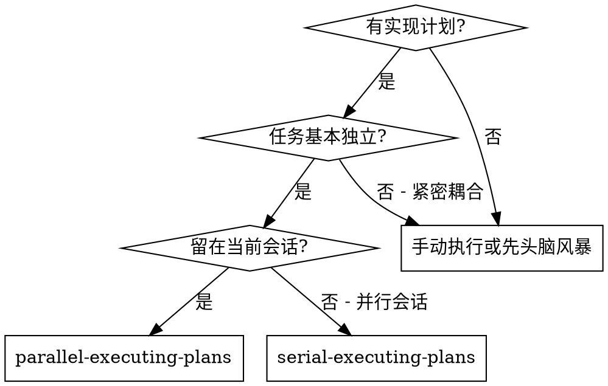
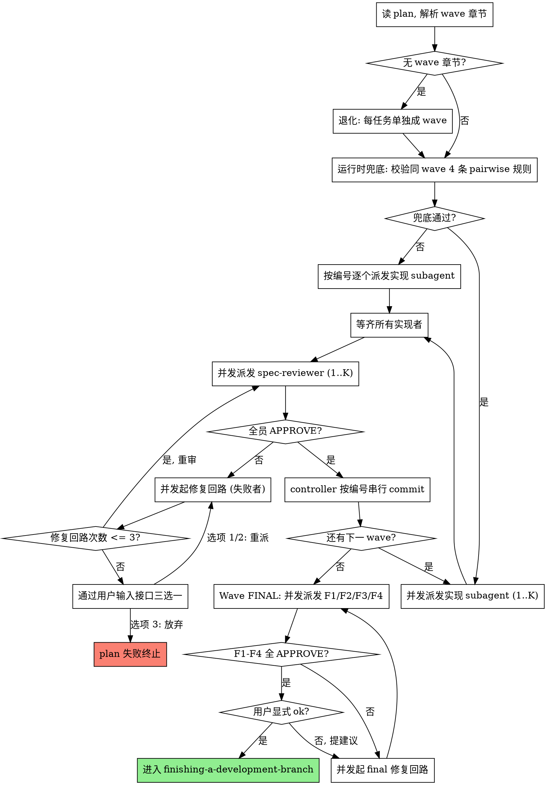

# 并行执行计划

通过 **wave 化并行调度**执行计划：wave 内并发派发实现子智能体（前提：同 wave 任务符号空间 pairwise 互不相交）、wave 间阻塞 gate；每任务后做 task-local 规格合规审查；全 plan 实现 wave 完成后启动 **Wave FINAL** 4 审并发（F1 规格合规 / F2 代码质量 / F3 真实手测 / F4 范围保真）；最终用户显式 ok 才进收尾。

**为什么用子智能体：** 你将任务委派给具有隔离上下文的专用智能体。通过精心设计它们的指令和上下文，确保它们专注并成功完成任务。它们不应继承你的会话上下文或历史记录——你要精确构造它们所需的一切。这样也能为你自己保留用于协调工作的上下文。

**核心原则：** wave 内并发派发实现者 + wave 间阻塞 gate + Wave FINAL 4 审 + 用户显式 ok = 高吞吐 + 高质量。每任务一个全新子智能体（隔离上下文）；commit 由 controller 在 wave 收口串行执行（避免并发 git 冲突）；同任务修复回路 > 3 次后请求用户输入介入。

## 何时使用



**与 Executing Plans（并行会话）的对比：**
- 同一会话（无上下文切换）
- 每个任务全新子智能体（无上下文污染）
- **wave 内并发派发实现者（前提：plan 含 `## 并行执行图` 章节，且同 wave 任务满足 R2+ 4 条 pairwise 规则——文件集 / 导出∩导出 / 导出∩消费 / 消费∩导出 全部为 ∅；`A.消费 ∩ B.消费` 允许）**
- 每个任务后规格合规审查（task-local，可并发）
- 全 plan 完成后启动 **Wave FINAL**：4 个 reviewer 并发（F1 规格合规 / F2 代码质量 / F3 真实手测 / F4 范围保真）
- 更快的迭代（任务间无需人工介入；wave 收口需用户显式 ok 才进收尾）

## 流程



## 运行时兜底校验

读完 plan 之后、派发 wave N 的 implementer 之前，必须执行以下校验：

1. **解析 wave 章节**：从 `## 并行执行图` 章节读出 wave N 的任务列表 `[T_a, T_b, T_c, ...]`。
2. **pairwise 安全前提检查**（4 条规则全部满足才允许并发）：对 wave N 内任意两任务 (A, B) 验证：
   - `A.文件集 ∩ B.文件集 = ∅`
   - `A.导出/变更接口 ∩ B.导出/变更接口 = ∅`
   - `A.导出/变更接口 ∩ B.消费接口 = ∅`
   - `B.导出/变更接口 ∩ A.消费接口 = ∅`
   - **不查 `A.消费 ∩ B.消费`**——同读上游接口不冲突（例如 wave-final 的 4 个 reviewer 同时消费 `wave-final-protocol` 是合法的）
3. **判定**：
   - 4 条全过 → 同消息内并发派发全部 K 个 implementer
   - 任一条破坏 → 降级为 wave 内按编号串行（仍是逐个派发，下一 wave 仍按 wave gate 规则等待）

兜底校验执行两个时刻：
- **plan 加载时全量校验**：派发 wave 1 之前，对全部 N 个 wave 的 4 条 pairwise 规则一次性校验完毕。
- **修复回路并发派发前**：仅校验当前 wave（修复回路本身是新增的并发动作，需要确认修复 subagent 之间也满足并发安全前提）。

正常 wave 派发不重跑——plan-document-reviewer 已做过同样检查，运行中不变量保持。

**并发安全说明：** 4 条规则保证了 wave 内任务的工作区不冲突——多个 implementer 或修复者同时编辑不同文件不存在 race，**无需 worktree 隔离或显式锁机制**。

## 模型选择

使用能胜任每个角色的最低成本模型，以节省开支并提高速度。

**机械性实现任务**（隔离的函数、清晰的规格、1-2 个文件）：使用快速、便宜的模型。当计划编写得足够详细时，大多数实现任务都是机械性的。

**集成和判断类任务**（多文件协调、模式匹配、调试）：使用标准模型。

**架构、设计和审查类任务**：使用最强的可用模型。

**任务复杂度信号：**
- 涉及 1-2 个文件且有完整规格 → 便宜模型
- 涉及多个文件且有集成考虑 → 标准模型
- 需要设计判断或广泛的代码库理解 → 最强模型

## 处理实现者状态

实现子智能体报告四种状态之一。根据每种状态进行相应处理：

**DONE：** 进入规格合规性审查。

**DONE_WITH_CONCERNS：** 实现者完成了工作但标记了疑虑。在继续之前阅读这些疑虑。如果疑虑涉及正确性或范围，在审查前解决。如果只是观察性说明（如"这个文件越来越大了"），记录下来并继续审查。

**NEEDS_CONTEXT：** 实现者需要未提供的信息。提供缺失的上下文并重新分派。

**BLOCKED：** 实现者无法完成任务。评估阻塞原因：
1. 如果是上下文问题，提供更多上下文并用同一模型重新分派
2. 如果任务需要更强的推理能力，用更强的模型重新分派
3. 如果任务太大，拆分为更小的部分
4. 如果计划本身有问题，上报给人类

**绝不** 忽略上报或在不做任何更改的情况下让同一模型重试。如果实现者说卡住了，说明有什么东西需要改变。

## 修复回路与 3 次逃生口

当 spec-reviewer 给出 ❌ 结果时，启动修复回路：

1. **打包上下文给修复 subagent**（修复者**不重读文件**）：
   - 原任务的完整文本（与初次派发同样）
   - **上一次实现者的产出报告**（包括它声称改了哪些文件、自审发现）
   - **上一次实现的实际 diff**（controller 用 `git diff` 提取 working tree 改动）
   - **当前 reviewer 的具体反馈**（缺什么、多什么、错在哪）
2. 派发 implementer-prompt 的"修复模式"（见 `./implementer-prompt.md`），它仍不 commit。
3. 修完后再派发 spec-reviewer 重审。

修复回路本身在 wave 内**并发**——多个任务同时不通过时，各自起独立修复回路同时跑。但下一 wave 必须等本 wave 全员通过 spec 审查 + commit 完成才开始（wave 间阻塞 gate）。

**并发安全说明：** 修复回路的并发安全由 R2+ 同 wave 安全前提（4 条 pairwise 规则）保证——同 wave 任务文件集 pairwise 互不相交，多个修复者同时编辑不同文件不存在 race。**无需 worktree 或显式锁。** 修复派发前 controller 重新执行兜底校验（修复回路是新增并发动作）。

### 3 次逃生口与 plan 失败处理

**设计原则：plan 是 AI 一次性烧掉的草稿，不是有状态的工程系统。** 中途任务死活搞不定时**不**维护 SKIP/BLOCKED 状态、**不**持久化 wave 进度、**不**做下游连锁追踪——直接判定 plan 失败，回头重新 brainstorm + writing-plans 写新 plan。

**3 次逃生口：** 同一任务的修复回路 ≤ 3 次。第 4 次仍未通过 → controller 通过用户输入接口向用户报告卡点，让用户**三选一**：

1. **提供更多上下文** → controller 重派修复（计数器重置，再 3 次窗口）
2. **用更强模型重派** → 同上，但换模型
3. **放弃 plan** → 整个 plan 标记为失败，建议回到 brainstorm + writing-plans 重新规划；当前会话退出 subagent-driven 流程

**没有"跳过任务继续跑"选项**——一旦失败就是 plan 失败。

**commit 闸门越界（详见下方）走同一处理路径：** 命中 → 通过用户输入接口 三选一。

## Commit 时机与文件集越界校验

implementer 与修复者**绝不**自行 commit。commit 在 wave 收口由 controller 串行执行，并设**双层文件集越界闸门**——wave 级硬约束 + 任务级软归因。

### 校验算法（关键设计）

**为什么不能"每任务跑 `git diff --name-only HEAD` 检查 ⊆ 该任务文件集"：** wave 内 N 个 implementer 并发完成后，工作区里堆叠 N 个任务的总改动。共享工作区下 controller 无法机械区分"哪些改动是哪个 implementer 写的"——只能信任 implementer 自报，配合事后审查。

### 两层闸门

**层 1：任务级 implementer 自报合规**

对每个任务 T（按编号顺序）：

1. 取 T 的 implementer 汇报清单 `claimed_files_T`
2. 校验：`claimed_files_T ⊆ T.**文件集：**`
3. **不通过 → plan 失败** → 通过用户输入接口 三选一
4. 通过 → controller 执行：
   ```bash
   git add <claimed_files_T 中的每个路径>
   git commit -m "<引用任务 T>"
   ```
5. 进入下一任务

**层 2：Wave 收口终态校验**

全部任务 commit 完成后，跑 `git diff --name-only HEAD`：

- 必须为空（工作区与 HEAD 完全一致，无未提交残留）
- **不空 → plan 失败** → 通过用户输入接口 三选一

通过层 2 后才进入下一 wave。

事后兜底由 Wave FINAL F4（范围保真）承担，捕捉 spec-reviewer 漏掉的"漏报文件被同 wave 别人 claim 走"场景。

## 提示词模板

**任务级（每 wave 收口运行）：**
- `./implementer-prompt.md` — 派发实现子智能体（含初次实现 + 修复模式分支）
- `./spec-reviewer-prompt.md` — 派发 task-local 规格合规审查

**Plan 级（所有 wave 完成后并发派发）：**
- `./wave-final-spec-prompt.md` — F1 全 plan 规格合规审查
- `./wave-final-quality-prompt.md` — F2 跨任务代码质量审查
- `./wave-final-manual-qa-prompt.md` — F3 真实手动 QA
- `./wave-final-scope-fidelity-prompt.md` — F4 范围保真检查

## Wave FINAL 协议

所有实现 wave 完成后**必须**启动 Wave FINAL：

1. **并发派发 F1-F4 四个 reviewer**（同条消息内 4 个 Task() 调用）：
   - F1：规格合规审查（用 `./wave-final-spec-prompt.md`）
   - F2：代码质量审查（用 `./wave-final-quality-prompt.md`）
   - F3：真实手测（用 `./wave-final-manual-qa-prompt.md`）
   - F4：范围保真（用 `./wave-final-scope-fidelity-prompt.md`）
2. **每个 reviewer 给 `VERDICT: APPROVE` 或 `VERDICT: REJECT + 问题清单`**
3. **任一 REJECT** → 派发修复 subagent 修复对应问题 → 仅重跑该 reject 的 reviewer（不要重跑全部 4 个）
4. **全员 APPROVE** → 向用户呈现 4 个 reviewer 的输出摘要 → **等待用户显式 ok**（绝不自动收尾）
5. **用户 ok 后** → 进入 `superpowers:finishing-a-development-branch`

**关键不变量：**
- 4 个 reviewer 的关注点互不重叠（F1 规格 / F2 质量 / F3 行为 / F4 范围），各自独立判定
- 用户显式 ok 是最后人机协同闸门——绝不跳过
- 用户给反馈但未 ok（例如要求修改） → 视为 REJECT，起对应修复回路

## 示例工作流

```
你：我正在使用并行执行计划 skill 执行这个计划（4 个任务，2 个 wave）。

[一次性读取计划文件 docs/superpowers/plans/feature-plan.md]
[提取全部 4 个任务的完整文本 + 解析 ## 并行执行图章节]
[plan 加载时全量 pairwise 校验：4 条规则全过 → 准予并发派发]
[用全部任务创建 TodoWrite]

=== Wave 1（任务 1 + 任务 2 并发）===

[同一消息内并发派发 2 个 implementer]

实现者 1（任务 1 - 添加用户验证）：
  - 改了 src/middleware/validate.ts + tests/validate.test.ts
  - 5/5 测试通过；改动文件清单与 **文件集：** 一致
  - 状态: DONE

实现者 2（任务 2 - 添加 schema）：
  - 改了 src/schema/user.ts
  - 自审：一切正常
  - 状态: DONE

[等齐两个实现者；并发派发 2 个 spec-reviewer]

spec-reviewer 1（任务 1）：✅ 符合规格
spec-reviewer 2（任务 2）：❌ 缺失：未声明 email 字段格式约束

[任务 2 起修复回路（任务 1 已通过，等收口）]
[修复回路并发派发前重新执行运行时兜底校验：通过]
[派发任务 2 修复 implementer，附带原任务文本 + 上次 diff + reviewer 反馈]
实现者 2（修复模式）：补上 email 字段约束；改动仍限于文件集；不 commit
spec-reviewer 2（重审）：✅ 现在符合规格

[Wave 1 全员通过 spec → controller 按编号顺序串行 commit]
$ git add src/middleware/validate.ts tests/validate.test.ts && git commit -m "...任务 1"
$ git add src/schema/user.ts && git commit -m "...任务 2"

[层 2 终态校验：git diff --name-only HEAD == "" → 通过]
[Wave 1 收口，进入 Wave 2]

=== Wave 2（任务 3 + 任务 4 并发，依赖 Wave 1）===

[同一消息内并发派发 2 个 implementer]
[流程同 Wave 1：实现 → spec → 修复（如需）→ controller 串行 commit → 终态校验]

[Wave 2 收口 → 全部实现 wave 完成]

=== Wave FINAL（4 reviewer 并发）===

[同一消息内并发派发 F1 / F2 / F3 / F4 四个 reviewer]
F1 规格合规：✅ APPROVE — Must Have 8/8 覆盖
F2 代码质量：✅ APPROVE — 跨任务命名一致
F3 真实手测：✅ APPROVE — 自动化 + happy path + 边界 + 集成全过
F4 范围保真：❌ REJECT — 任务 3 commit 含 1 处不在 What to do 内的改动

[仅重跑 F4 修复回路（F1/F2/F3 已通过不重跑）]
[派发修复 subagent 移除游离改动 → 重跑 F4：✅ APPROVE]

[呈现 4 reviewer 输出摘要给用户，等用户显式 ok]
你：ok

[进入 superpowers:finishing-a-development-branch]

完成！
```

## 红线

**绝不：**
- 未经用户明确同意就在 main/master 分支上开始实现
- 跳过审查（任务级 spec 合规 / Wave FINAL F1-F4 任一）
- 带着未修复的问题继续
- 在违反"同 wave 安全前提（4 条 pairwise 规则：文件集 / 导出∩导出 / 导出∩消费 / 消费∩导出 全部为空集）"下并行分派实现子智能体。运行时兜底校验失败时必须降级为 wave 内编号串行。
- 让子智能体读取计划文件（应提供完整文本）
- 跳过场景铺设上下文（子智能体需要理解任务在哪个环节）
- 忽视子智能体的问题（在让它们继续之前先回答）
- 在规格合规性上接受"差不多就行"（规格审查者发现问题 = 未完成）
- 跳过审查循环（审查者发现问题 = 实现者修复 = 再次审查）
- 让实现者的自审替代正式审查（两者都需要）
- 在 wave 内任一任务 spec 未通过时就进入下一 wave（必须等齐 + commit 完毕）
- 在 Wave FINAL 任一 reviewer REJECT 时就进入用户 ok 闸门（必须先修复 + 重跑该 reviewer）
- 用户未显式 ok 就进入 finishing-a-development-branch（绝不自动收尾）

**如果子智能体提问：**
- 清晰完整地回答
- 必要时提供额外上下文
- 不要催促它们进入实现阶段

**如果审查者发现问题：**
- 实现者（同一子智能体）修复
- 审查者再次审查
- 重复直到通过
- 不要跳过重新审查

**如果子智能体失败：**
- 分派修复子智能体并提供具体指令
- 不要尝试手动修复（上下文污染）

## 集成

**必需的工作流技能：**
- **superpowers:using-git-worktrees** - 必需：在开始前建立隔离工作区
- **superpowers:writing-plans** - 创建本技能执行的计划
- **superpowers:requesting-code-review** - 审查子智能体的代码审查模板
- **superpowers:finishing-a-development-branch** - 所有任务完成后收尾

**子智能体应使用：**
- **superpowers:test-driven-development** - 子智能体对每个任务遵循 TDD

**替代工作流：**
- **superpowers:serial-executing-plans** - 用于并行会话而非同会话执行（不支持子代理的平台必备）

